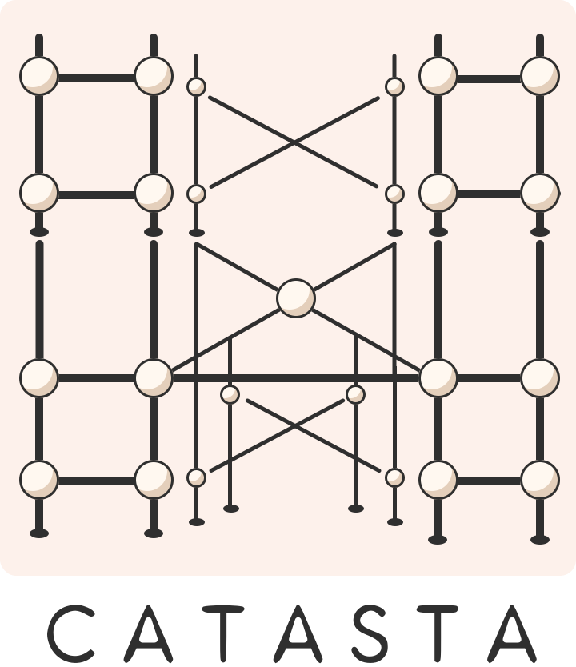

# Catasta: Streamlined Model Experimentation

<p align="center">
    
</p>

[](https://pypi.org/project/catasta/)
[](http://choosealicense.com/licenses/mit/)
<!-- [](https://catasta.readthedocs.io/en/latest/) -->

Catasta is a Python library designed to simplify and accelerate the process of machine learning model experimentation. It encapsulates the complexities of model training and evaluation, offering researchers and developers a straightforward pipeline for rapid model assessment with minimal setup required.

> Note: Catasta only supports regression and classification at the moment.

> Important: Catasta is subject of change until a major version is launched.

## Key features

Catasta is a very simple package, containing only five modules, each one with an specific purpose. 

The `models` module houses a variety of machine learning models.

The `datasets` module provides an easy way to import the data contained in directories, being also able to modify the data shape in an easy way.

The `transformations` module lets you apply transformations to the data when its loaded to a dataset.

The `scaffolds` module is where models and datasets are integrated for training. Scaffolds handle training and evaluation. 

The `archways` module takes a trained model and handles the inference task.

## Installation

### Install via pip

Catasta is available as a PyPi package:

```sh
pip install catasta
```

### Install from source

Clone the repository

```sh
git clone https://github.com/vistormu/catasta
```

and install the dependencies

```sh
pip install -r requirements.txt
```

## Documentation

Work in progress
