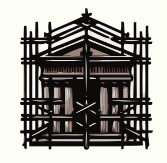

# Catasta: Streamlined Model Experimentation

<div align="center">

    
[](https://pypi.org/project/catasta/)
[](http://choosealicense.com/licenses/mit/)
<!-- [](https://catasta.readthedocs.io/en/latest/) -->
</div>

_Catasta_ is a Python library designed to simplify the process of Machine Learning model experimentation. Optimization, training, evaluation and inference all in one place!

> [!WARNING]
> :construction: _Catasta_ is in early development :construction:
> 
> Expect breaking changes on every release until `v1.0.0` is reached.
> 
> The documentation is under development.

---

With _Catasta_, you can build a model like an _archway_... Let me explain:

### Optimization

First, set the foundations of the model with the `Foundation` class. This class uses the popular and supercool [optuna](https://github.com/optuna/optuna) library to optimize a model given a hyperparameter space and an objective function.

```python
hp_space = {
    "n_patches": (2, 7),
    "d_model": (8, 16),
    "n_layers": (1, 2),
    "n_heads": (1, 2),
    "feedforward_dim": (8, 16),
    "head_dim": (4, 8),
    "dropout": (0.0, 0.5),
    "layer_norm": (True, False),
}

foundation = Foundation(
    hyperparameter_space=hp_space,
    objective_function=objective,
    sampler="bogp",
    n_trials=100,
    direction="maximize",
    use_secretary=True,
    catch_exceptions=True,
)

optimization_info = foundation.optimize()
```

### Training

Set the scaffolds of your model with the `Scaffold` class. This class integrates a model and a dataset for training and evaluation.

```python
model = FeedforwardRegressor(
    context_length=32,
    hidden_dims=[8, 16, 8],
    dropout=0.0,
    use_layer_norm=True,
    activation="relu",
)

dataset = CatastaDataset(
    root="path/to/dataset/",
    task="regression",
)

scaffold = Scaffold(
    model=model,
    dataset=dataset,
    optimizer="adamw",
    loss_function="mse",
)

scaffold.train(
    epochs=100,
    batch_size=256,
    lr=1e-3,
)

info = scaffold.evaluate()
```

### Inference

Your archway is finished with the `Archway` class. This class runs the inference of the model given its saved path.

```python
archway = Archway("path/to/saved/model/")

prediction = archway.predict(input)
```

### Other modules

_Catasta_ also has different modules that facilitate model experimentation.

* `catasta.models` offers a variety of pre-implemente Machine Learning models. All models are **single-scripted**, so feel free to copy and paste them anywhere.

* `catasta.transformations` let's you apply transformations to the data when its loaded to a dataset, such as window sliding, normalization...

* `catasta.utils` has several functions that are useful for model optimization and training.

## Installation

### Install via pip

Catasta is available as a PyPi package:

```sh
pip install catasta
```

### Install from source

Clone the repository

```sh
git clone https://github.com/vistormu/catasta
```

and install the dependencies

```sh
pip install -r requirements.txt
```
